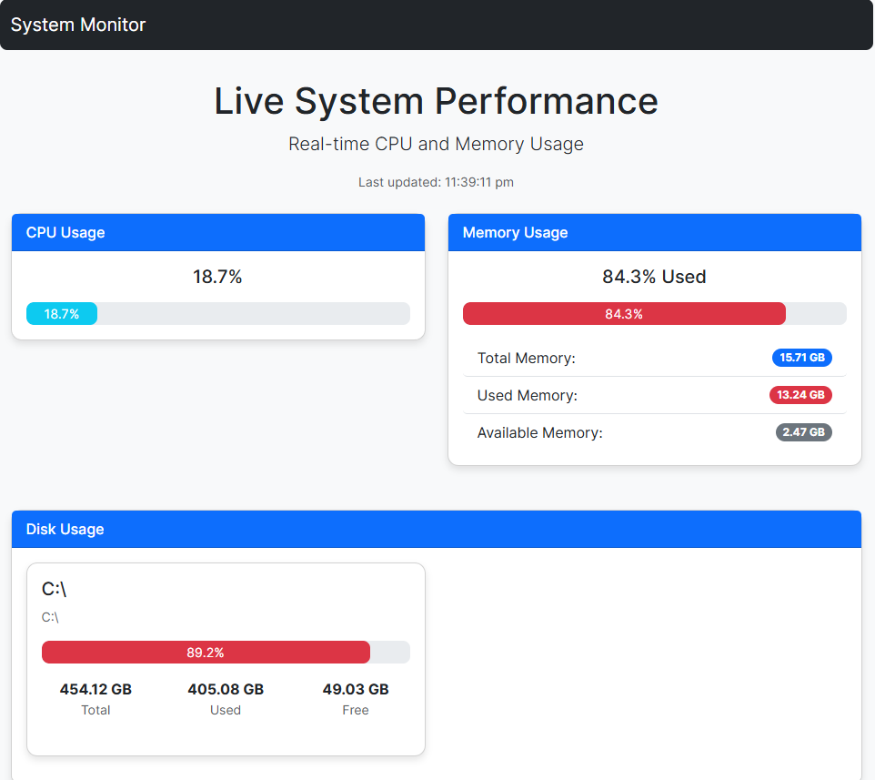
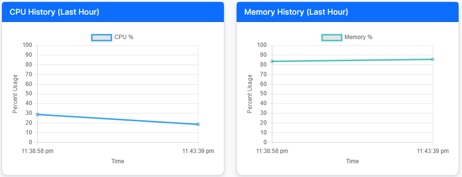

# System Performance Monitor


A modern, modular system monitoring dashboard built with FastAPI that provides real-time and historical visualization of system performance metrics.

# Dashboard Preview
#### Preview 1

#### Preview 2


## ✨ Features

- **🚀 Real-time System Metrics**
  - CPU usage with per-core breakdown
  - Memory usage with detailed allocation statistics
  - Disk usage across all partitions with I/O stats
  - Network traffic monitoring
  - Top resource-consuming processes

- **📊 Interactive Data Visualization**
  - Time-series charts with hover details
  - Historical performance data 
  - Customizable time ranges (1h, 6h, 24h)
  - Automatic periodic updates

- **⚠️ Intelligent Alerting**
  - Configurable CPU and memory thresholds
  - Visual and log-based alerts
  - Historical alert tracking

- **🧩 Modular Architecture**
  - Clean separation of concerns
  - Object-oriented design principles
  - Easily extensible codebase

## 🏗️ Architecture

The application follows a modular, object-oriented design with clear separation of concerns:

```
fastapi_monitor/
│
├── app/                    # Core application package
│   ├── api/                # API endpoints and routes
│   │   └── endpoints.py    # API route definitions
│   │
│   ├── core/               # Core functionality
│   │   ├── config.py       # Application configuration
│   │   ├── metrics_recorder.py  # Background metrics service
│   │   └── system_monitor.py    # System metrics collection
│   │
│   ├── database/           # Database operations
│   │   └── db_manager.py   # Database interaction layer
│   │
│   ├── models/             # Data models (extensible)
│   └── main.py             # FastAPI application setup
│
├── templates/              # Frontend templates
│   └── index.html          # Dashboard UI
│
├── system_metrics.db       # SQLite database file
├── run.py                  # Entry point script
├── requirements.txt        # Project dependencies
├── README.md               # Documentation Application
└── testing.md              # Documentation Testing
```

## 📋 Requirements

- Python 3.7+
- FastAPI
- Uvicorn
- psutil
- SQLite3
- Jinja2

## 🚀 Quick Start

### Installation

1. Clone the repository:
   ```bash
   git clone https://github.com/yourusername/system-performance-monitor.git
   cd system-performance-monitor
   ```

2. Create and activate a virtual environment (optional but recommended):
   ```bash
   python -m venv venv
   # On Windows:
   .\venv\Scripts\activate
   # On Linux/macOS:
   source venv/bin/activate
   ```

3. Install dependencies:
   ```bash
   pip install -r requirements.txt
   ```

### Running the Application

Start the application with:

```bash
python run.py
```

Or directly with Uvicorn:

```bash
uvicorn app.main:app --reload --host 0.0.0.0 --port 8000
```

Then open your browser and navigate to:
http://localhost:8000

## 🔌 API Endpoints

| Endpoint | Method | Description |
|----------|--------|-------------|
| `/` | GET | Main dashboard UI |
| `/api/system-info` | GET | Current system metrics (CPU, memory, disk, network) |
| `/api/processes` | GET | Top processes by resource usage |
| `/api/history/cpu` | GET | Historical CPU data (with optional `hours` parameter) |
| `/api/history/memory` | GET | Historical memory data (with optional `hours` parameter) |
| `/api/alerts` | GET | Recent system alerts (with optional `limit` parameter) |

## ⚙️ Configuration

### Application Settings

Modify `app/core/config.py` to adjust:
- Metrics collection interval
- Alert thresholds
- Database path
- Server host and port settings

```python
# Example configuration
METRICS_INTERVAL_SECONDS = 60  # Collect metrics every minute
CPU_ALERT_THRESHOLD = 80       # CPU usage percentage alert threshold
MEMORY_ALERT_THRESHOLD = 80    # Memory usage percentage alert threshold
```

### Frontend Refresh Rate

Adjust the dashboard update frequency in `templates/index.html`:

```javascript
// Modify this value to change the update interval (milliseconds)
const updateInterval = 5000;  // 5 seconds
```

## 📈 Dashboard Features

- **Real-time Metrics Display**: Auto-refreshing widgets showing current system state
- **Resource Usage Gauges**: Visual indicators with color-coding based on usage levels
- **Time-Series Charts**: Historical data visualization with interactive tooltips
- **System Alerts Panel**: Notification area for critical system events
- **Process List**: Table of top resource-consuming processes
- **Manual Refresh**: Button to force immediate data refresh

## 🧪 Testing

The project includes a comprehensive test suite with unit tests and integration tests. The tests are organized by type and component to make them easier to run and maintain.

### Running Tests

You can run tests using the included test runner script:

```bash
# Run all tests
python run_tests.py

# Run only unit tests
python run_tests.py --type unit

# Run only integration tests
python run_tests.py --type integration

# Run with coverage reporting
python run_tests.py --coverage

# Run verbosely
python run_tests.py --verbose

# Run specific component tests
python run_tests.py --type api
python run_tests.py --type db
python run_tests.py --type monitor
python run_tests.py --type metrics
```

Or use pytest directly:

```bash
# Run all tests
pytest

# Run specific test types
pytest -m unit
pytest -m integration

# Run with coverage
pytest --cov=app --cov-report term-missing
```

### Test Structure

```
tests/
├── fixtures/                # Test fixtures and mocks
│   ├── api_fixtures.py      # Fixtures for API tests
│   └── db_fixtures.py       # Fixtures for database tests
├── integration/             # Integration tests
│   └── test_api_endpoints.py # API endpoint tests
└── unit/                    # Unit tests
    ├── test_db_manager.py   # Database manager tests
    ├── test_metrics_recorder.py # Metrics recorder tests
    └── test_system_monitor.py  # System monitor tests
```

## 🔧 Extending the Application

### Adding New Metrics

1. Add collection logic to `SystemMonitor` class in `app/core/system_monitor.py`
2. Update database schema in `DatabaseManager` class in `app/database/db_manager.py`
3. Add API endpoint in `app/api/endpoints.py`
4. Update frontend in `templates/index.html` to display the new metrics

### Adding New Alert Types

1. Define the alert criteria in `MetricsRecorder` class in `app/core/metrics_recorder.py`
2. Update the frontend to display the new alert types

## 🔒 Security Considerations

- The application currently has no authentication - add FastAPI's security dependencies for production use
- Consider using environment variables for sensitive configuration
- Implement rate limiting for API endpoints if exposed publicly

## 📝 License

This project is licensed under the MIT License - see the LICENSE file for details.

## 👏 Acknowledgments

- [FastAPI](https://fastapi.tiangolo.com/) - The modern Python web framework
- [psutil](https://github.com/giampaolo/psutil) - Cross-platform system monitoring
- [Chart.js](https://www.chartjs.org/) - Simple yet flexible JavaScript charting
- [Bootstrap](https://getbootstrap.com/) - Frontend component library
